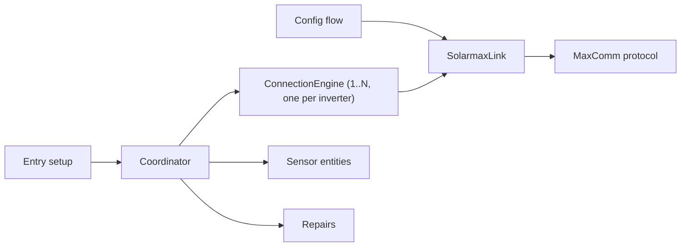

# Architecture

Solarmax Inverter separates protocol parsing, socket ownership, connection policy, Home Assistant scheduling, and entity presentation. Keep those boundaries when adding behavior.

## Component responsibilities

### Protocol

`protocol.py` builds MaxComm frames, validates checksums, splits responses, scales register values, and skips malformed individual fields. It does not open sockets or classify connection state.

The protocol groups fields by traffic pattern:

- Static and device fields include installed limits, model, firmware, and serial number. The engine requests them at connection start, with one bounded backfill attempt for missing values.
- Hot fields contain readings that can change each poll.

### Link

`SolarmaxLink` owns the persistent `asyncio` reader and writer for one entry, shared by every inverter behind that endpoint. A request lock permits one exchange at a time. A peer close triggers one reconnect and resend. Terminal `close()` blocks later requests and prevents an in-flight connect from publishing a new socket.

Connect-stage failures are typed so the coordinator can tell an unreachable endpoint from a silent inverter: a connect timeout raises `LinkConnectTimeout` (a `LinkTimeout` subclass), and a refused or failed connect, including a failed post-connect socket configuration, raises `LinkConnectFailed` (a `LinkClosed` subclass). Exchange failures still raise the base `LinkTimeout` or `LinkClosed`. `_request_with_retry` catches `LinkTimeout`, so a connect timeout is retried once inside a poll before it can surface as a connect failure. A response timeout still aborts the transport, so the next engine on the shared link reconnects before its own request.

Use `disconnect()` for an expected night shutdown because an engine must reopen the link at dawn. Use `close()` only during entry teardown.

### Connection engine

`ConnectionEngine` keeps a single-address contract: one engine per inverter subentry, each with its own state, arming tracker, static values, fault clock, and diagnostics. It serializes its own polls, enforces a per-engine poll budget (`max(15 s, connect_timeout + 4 × response_timeout)`, so it grows when the response timeout is raised), caches values, retries a timeout or corrupt frame once, and returns an `EngineSnapshot`. Link and protocol failures become snapshot state instead of escaping to the coordinator. `EngineSnapshot` carries a `link_failure` field (`None`, `connect`, or `exchange`) set from the exception type that ended the poll. A reply from a different inverter address raises a retryable protocol error, so the engine's existing retry-once policy handles it and a second mismatch fails the poll.

The engine does not own the shared link. It never calls `disconnect()` or `close()` on it; `close()` on the engine only marks that engine closed and drains its own poll lock. The engine exposes `record_bus_failure()`, which classifies a bus-wide connect failure from the engine's own arming and sun evidence without touching the link; the coordinator calls it for every engine it skips after a connect-stage failure elsewhere in the cycle.

The engine classifies state from current observations:

| Observation | Result |
| --- | --- |
| Successful poll | `online` |
| Previous poll reported `SYS=20002` or `PDC < 25 W`, then the link fails | `offline_expected` |
| Sun below the configured threshold, then the link fails | `offline_expected` |
| Initial daytime failures within 150 seconds | `unknown` with `reconnecting` |
| Other daytime failure | `offline_fault` |
| Armed failure above the threshold for one hour and ten probes | `offline_fault` |

A successful poll clears prior failure timing and recomputes the shutdown arm. Entering an expected period clears the repair clock.

### Coordinator

`SolarmaxCoordinator` owns the shared link and a mapping from subentry ID to `ConnectionEngine`; its data is a mapping from subentry ID to `EngineSnapshot`. A coordinator-level cycle lock serializes whole cycles: scheduled and debounced refreshes, the validation handoff, and shutdown all take it, so two overlapping refreshes can never interleave requests from different cycles.

One cycle polls every engine in subentry order, one request at a time. When an engine's snapshot reports `link_failure == "connect"`, the coordinator calls `record_bus_failure()` on every engine not yet polled in that cycle and sends no further requests; each engine still classifies the failure from its own evidence, so a dark inverter reaches `offline_expected` and a daytime one reaches `offline_fault`. An `exchange` failure affects only the engine that observed it, and the cycle continues with the next engine. The worst case is the per-engine poll budget (15 seconds, or more when the response timeout is raised) multiplied by the inverter count, about 150 seconds for ten dark inverters, and the cycle lock means the effective cadence during such a cycle is the cycle length rather than the configured interval.

The next interval is the minimum, over all inverters, of the interval the rule below assigns to that inverter's own state:

- `online`: configured interval
- startup reconnect or `offline_fault`: configured interval capped at 60 seconds
- `offline_expected` during full night: 900 seconds
- `offline_expected` from civil dawn (-6° while rising) or during daytime: 60 seconds

The civil-dawn check is evaluated per inverter against that inverter's own
twilight threshold before the minimum across inverters is taken. The internal
civil-dawn threshold affects scheduling only; each inverter's configured
twilight elevation remains the source of its own fault classification.
Without a `sun.sun` entity, classification uses 20:00-06:00 and fast recovery
polling uses 05:00-20:00. The fallback logs one warning per coordinator
instance, and diagnostics expose the active sun source.

The coordinator disconnects the shared link only when every engine on it is expected offline; an engine no longer disconnects the link itself when it enters `offline_expected`.

One repair issue per endpoint, ID `connection_issues_{entry_id}`, is created once at least one inverter has been in `offline_fault` for five minutes, with placeholders listing every currently faulted inverter by name. It is updated as the faulted set changes and cleared when no inverter is in fault. The repair flow lets the user edit the host and port, then probes the proposed endpoint during a validation handoff. A successful probe marks the same issue as pending verification; the coordinator tracks which of the previously faulted subentries have completed an online poll since restart and removes the pending marker only once every one of them has, or has been removed. A separate, non-fixable `no_inverter` issue is created instead when the entry has zero inverter subentries; the coordinator then holds no link and no engines and leaves the update interval at its configured value.

Home Assistant owns the repair issue's native **Ignore** state. The coordinator
updates one stable issue ID during a fault episode, and the repair flow preserves
the issue metadata when it adds the pending marker. A verified recovery deletes
the issue, so a later fault starts a new issue without the old Ignore state.

The coordinator also exposes per-subentry device metadata and sends a local-midnight listener update for daily energy rollover, registered once per entry when any subentry has night-keep enabled.

### Sensors

`SolarmaxSensor` turns snapshot values into Home Assistant entities. Each inverter subentry gets the full sensor set, added with `config_subentry_id`; unique IDs are `{subentry_id}-{key}` and device identifiers are `{(solarmax, subentry_id)}`. Entity IDs for a new inverter derive from its subentry's device name. The Status Code entity, and its diagnostic attributes, are per inverter and remain available during that inverter's own connection failures. Other entities use the per-key night policy from `const.py` when the user enables overnight values for that inverter.

Entity unique IDs form persistent user data. `_UNIQUE_ID_MIGRATIONS` in `__init__.py` handles any required key rename, matching the `{subentry_id}-{key}` form. Removing a subentry removes its device and entities through Home Assistant.

### Setup and teardown

Schema version 3 stores host and port in `ConfigEntry.data`, and update
interval, checksum preference, and response timeout in `ConfigEntry.options`.
Each inverter is a `ConfigSubentry` of type `inverter`, its data holding
`address`, `device_name`, `twilight_elevation_threshold`, and
`night_keep_values`, with the address as its unique ID. Migrating a version 1
or 2 entry falls through version 2's existing step into a version 3
reconciliation: it creates the missing `inverter` subentry from the legacy
data and options, moves every entity's unique ID and `config_subentry_id`
under it, moves the existing device under the subentry with its device ID
preserved, and then drops the moved fields from `data`/`options` and sets the
entry's unique ID to `host:port`. Every step is idempotent and its version
bump is its last write, so a failure at any point leaves an entry the next
attempt completes. Entity IDs and history are untouched. When a second entry
already owns the same `host:port`, the migrating entry does not become a rival
endpoint: its inverter is folded in as a subentry of the survivor (migrating
the survivor to version 3 first if needed), its device and entities move
across with their IDs preserved, and the duplicate entry is scheduled for
removal so it never loads. A downgrade from `v1.5.0` requires a Home Assistant
backup from before the migration, as it did for version 2.

The initial config flow uses a short-lived `SolarmaxLink` to probe the first
inverter's address and creates the entry together with its first `inverter`
subentry in one call. **Add inverter** and inverter **Reconfigure** probe
only the address being added or changed, through the coordinator's
`validation_handoff()`, which takes the cycle lock, disconnects the link, and
yields so the probe can use the endpoint's single client slot; a name-only or
preference-only inverter change is saved without a probe. Parent
**Reconfigure** (host or port) and the repair fix flow probe every inverter
through `validate_endpoint` over one shared link: every inverter that is
currently online must answer, an inverter that is not online is tolerated, and
at least one answer is required when no inverter is online or the entry is not
loaded. The endpoint reconfigure keeps a title the user set and retitles to the
new host only while the title still equals the old host. The Options flow only
accepts update interval, checksum, and response timeout, and never probes.

The domain-scoped `configuration_mutation_lock` serializes setup,
reconfiguration, Options, subentry, and repair mutations across all entries.
Endpoint checks run again while the caller holds that lock.

Home Assistant does not reload an entry when a subentry is added, changed, or
removed, so the entry registers an update listener that compares a runtime
fingerprint of the subentries, the set of `(subentry_id, address,
twilight_elevation_threshold, night_keep_values)` tuples, to the fingerprint
the running coordinator was built from, and schedules a reload only when they
differ. A device-name-only change is not part of the fingerprint; the flow
updates the device registry directly instead. An entry with zero `inverter`
subentries loads and stays idle: the coordinator holds no link and no
engines, and a non-fixable `no_inverter` repair issue tells the user to add
one.

Endpoint and preference changes use one reload transaction. The transaction
captures `data`, `options`, title, and config-entry unique ID before applying a
change. If Home Assistant cannot load the changed entry, the transaction
restores the snapshot and reloads the prior configuration. Cancellation waits
for the apply-or-rollback transaction to reach a stable state.

Entry setup stores the coordinator in typed `ConfigEntry.runtime_data`,
migrates entity IDs, forwards the sensor platform, and registers the
midnight listener. Coordinator shutdown takes the cycle lock, closes every
engine, and then closes the shared link exactly once; entry unload and a
failed setup both go through that shutdown.

## Test strategy

Most tests use `tools/inverter_emulator.py` through `tests/emulator.py`. The emulator reproduces a persistent MaxComm connection, single-client behavior, idle close, darkness, partial responses, and injected failures.

`tests/test_protocol.py` covers pure framing and parsing. Connection and coordinator tests cover state transitions, retry limits, timing, repairs, shutdown races, and night values. Repository tests keep versions, translations, HACS metadata, agent guides, and release tags consistent.

Run `script/check` before committing. Use `tools/probe_connection.py` against hardware only when the emulator cannot answer the question; the probe occupies the inverter's one client slot.
