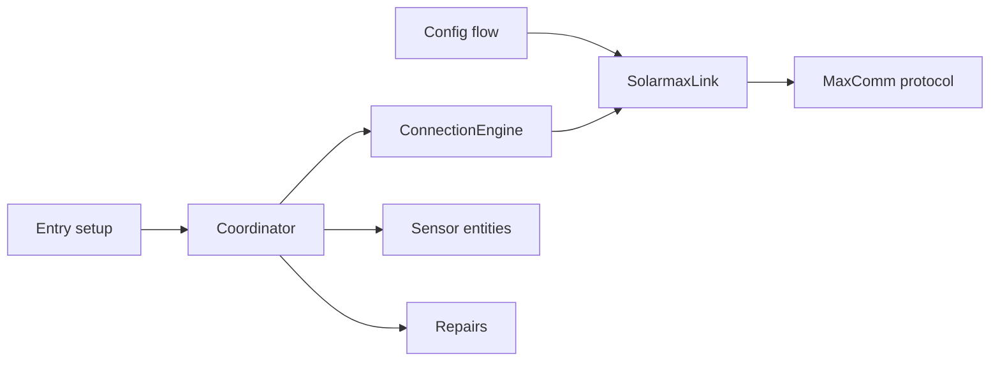

# Architecture

Solarmax Inverter separates protocol parsing, socket ownership, connection policy, Home Assistant scheduling, and entity presentation. Keep those boundaries when adding behavior.

## Component responsibilities

### Protocol

`protocol.py` builds MaxComm frames, validates checksums, splits responses, scales register values, and skips malformed individual fields. It does not open sockets or classify connection state.

The protocol groups fields by traffic pattern:

- Static and device fields include installed limits, model, firmware, and serial number. The engine requests them at connection start, with one bounded backfill attempt for missing values.
- Hot fields contain readings that can change each poll.

### Link

`SolarmaxLink` owns the persistent `asyncio` reader and writer. A request lock permits one exchange at a time. A peer close triggers one reconnect and resend. Terminal `close()` blocks later requests and prevents an in-flight connect from publishing a new socket.

Use `disconnect()` for an expected night shutdown because the engine must reopen the link at dawn. Use `close()` only during entry teardown.

### Connection engine

`ConnectionEngine` serializes polls, enforces the 15-second poll budget, caches values, retries a timeout or corrupt frame once, and returns an `EngineSnapshot`. Link and protocol failures become snapshot state instead of escaping to the coordinator.

The engine classifies state from current observations:

| Observation | Result |
| --- | --- |
| Successful poll | `online` |
| Previous poll reported `SYS=20002` or `PDC < 25 W`, then the link fails | `offline_expected` |
| Sun below the configured threshold, then the link fails | `offline_expected` |
| Initial daytime failures within 150 seconds | `unknown` with `reconnecting` |
| Other daytime failure | `offline_fault` |
| Armed failure above the threshold for one hour and ten probes | `offline_fault` |

A successful poll clears prior failure timing and recomputes the shutdown arm. Entering an expected period clears the repair clock.

### Coordinator

`SolarmaxCoordinator` calls the engine and returns its snapshot to Home Assistant. The coordinator catches unexpected exceptions so entry setup can create entities while the inverter sleeps.

It chooses the next interval from state:

- `online`: configured interval
- startup reconnect or `offline_fault`: configured interval capped at 60 seconds
- `offline_expected` during full night: 900 seconds
- `offline_expected` from civil dawn (-6° while rising) or during daytime: 60 seconds

The internal civil-dawn threshold affects scheduling only. The configured
twilight elevation remains the source of fault classification. Without a
`sun.sun` entity, classification uses 20:00-06:00 and fast recovery polling
uses 05:00-20:00. The fallback logs one warning per coordinator instance, and
diagnostics expose the active sun source.

A fault lasting five minutes creates a Home Assistant repair issue. Recovery or an expected period removes it. Completing the repair flow suppresses the same fault episode for 24 hours.

The coordinator also exposes device metadata and sends a local-midnight listener update for daily energy rollover.

### Sensors

`SolarmaxSensor` turns snapshot values into Home Assistant entities. The Status Code entity remains available during connection failures and exposes the state plus diagnostic attributes. Other entities use the per-key night policy from `const.py` when the user enables overnight values.

Entity unique IDs form persistent user data. `_UNIQUE_ID_MIGRATIONS` in `__init__.py` handles any required key rename.

### Setup and teardown

The initial config flow uses a short-lived `SolarmaxLink` to request and validate `PAC`. It closes the link in `finally`. The options flow validates the schema and reloads the entry without a second connection because the running engine owns the inverter's single slot.

Entry setup stores the coordinator in typed `ConfigEntry.runtime_data`, migrates entity IDs, forwards the sensor platform, and registers the midnight listener. Entry unload closes the engine after platform teardown succeeds.

## Test strategy

Most tests use `tools/inverter_emulator.py` through `tests/emulator.py`. The emulator reproduces a persistent MaxComm connection, single-client behavior, idle close, darkness, partial responses, and injected failures.

`tests/test_protocol.py` covers pure framing and parsing. Connection and coordinator tests cover state transitions, retry limits, timing, repairs, shutdown races, and night values. Repository tests keep versions, translations, HACS metadata, agent guides, and release tags consistent.

Run `script/check` before committing. Use `tools/probe_connection.py` against hardware only when the emulator cannot answer the question; the probe occupies the inverter's one client slot.
